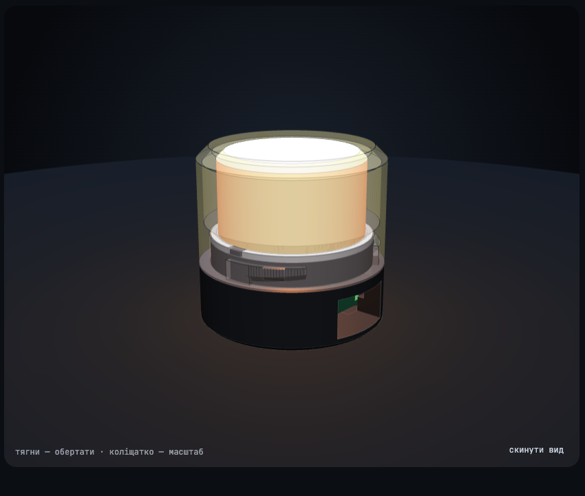
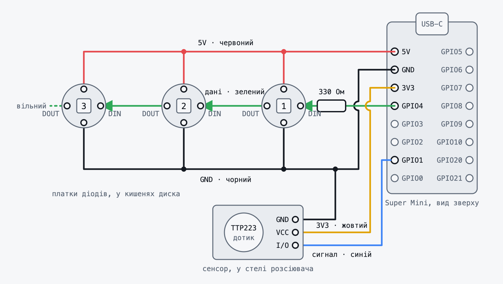

# AgentLight

Маленька лампа на ESP32-C3 Super Mini, яка кольором показує, що зараз робить AI-агент. Стоїть на столі, живиться від USB-C, статуси отримує по WiFi від хуків Claude Code або як MCP-сервер.



| Світло | Що означає |
|---|---|
| оранжевий, «дихає» | агент працює |
| червоний, блимає | агент чекає на тебе: дозвіл або питання |
| червоний, рівний | помилка |
| зелений | готово |
| синій, «дихає» | лампа чекає налаштування WiFi |
| фіолетовий, «дихає» | немає WiFi |

Якщо агентів кілька, лампа показує найважливіший стан: помилка > чекає > працює > готово.

## Що в репозиторії

| Тека | Що там | Документ |
|---|---|---|
| [`firmware/`](firmware/) | прошивка (PlatformIO, Arduino) і тестова прошивка для перевірки пайки | [docs/firmware.md](docs/firmware.md) |
| [`case/`](case/) | параметрична модель корпусу, перевірка, файли до друку, 3D-превью | [docs/case.md](docs/case.md) |
| [`hooks/`](hooks/) | хуки для Claude Code, OpenCode, Codex та інших агентів і встановлювач; лампа роздає їх сама | [docs/hooks.md](docs/hooks.md) |
| [`web/`](web/) | сайт: налаштування WiFi по Bluetooth і вхід до 3D-превью; локальний сервер | [docs/site.md](docs/site.md) |
| [`docs/`](docs/) | компоненти, схема підключення, складання | [docs/bom.md](docs/bom.md), [docs/wiring.md](docs/wiring.md) |

Стани лампи й те, які агенти крім Claude Code можна підключити: [docs/agents.md](docs/agents.md).

## Зібрати свою

1. **Купити деталі** — [список компонентів](docs/bom.md): плата, три діоди на круглих платках, сенсорна кнопка, резистор, дріт.
2. **Надрукувати корпус** — п'ять деталей у трьох кольорах, без підтримок: [файли й налаштування](docs/case.md).
3. **Спаяти** — [схема й порядок пайки](docs/wiring.md).
4. **Прошити** — `cd firmware && pio run -t upload`: [прошивка](docs/firmware.md).
5. **Підключити до WiFi** — по Bluetooth зі сторінки `web/setup.html` або через точку доступу лампи: [сайт](docs/site.md).
6. **Під'єднати агента** — одна команда зі сторінки лампи: [підключення агентів](docs/hooks.md).



## Швидкий старт на новій машині

```sh
git clone <адреса репозиторію> agentlight && cd agentlight

python3 web/serve.py                       # сайт: http://localhost:8791/web/

cd firmware && pio run -t upload           # прошивка (потрібен PlatformIO)

python3 -m venv .venv && .venv/bin/pip install -r case/requirements.txt
.venv/bin/python case/build.py             # перебудувати корпус
.venv/bin/python case/verify.py            # перевірити його
```

## Стан проєкту

Що перевірено на залізі:

- Прошивка: сторінка лампи, REST і MCP (запитами curl), хуки Claude Code з кількома сесіями одночасно.
- Тестова прошивка: діоди й сенсор TTP223 реагують, дотики видно в лозі порту.
- Bluetooth: лампа знаходиться з Mac, віддає стан і список мереж WiFi (перевірено скриптом, не сторінкою).
- Дебаг-меню (запитами до API): налаштування зберігаються й переживають перезавантаження, дії «веселка» і «перезавантажити» працюють.
- Сенсор в основній прошивці: дотики рахуються.
- Оновлення по WiFi: і через запит до лампи, і через PlatformIO; невірний пароль і файл-сміття відхиляються.

Що зроблено, але ще не перевірено в роботі:

- Кілька збережених мереж WiFi: збережена лише одна, вибір між кількома не пробували.
- Дії сенсора («побачив», яскравість, вимкнути світло) і сама сторінка дебаг-меню в браузері.
- Сторінка `web/setup.html` у Chrome: додавання мережі й перепідключення після перезавантаження лампи.
- Корпус: модель проходить `case/verify.py`; деталі надруковані, але посадки після останніх змін розсіювача (гніздо під сенсор, притискання ковпаком) не підтверджені.
- MCP як сервер у Claude Code: перевірявся лише запитами curl.

Розміри, взяті як типові, а не виміряні: товщина плати ESP (1,0 мм), товщина платки діода (1,2 мм), модуль TTP223 (15 × 11 × 2 мм).

Захисту немає: будь-хто у твоїй мережі WiFi може міняти стан і налаштування лампи, будь-хто поруч із Bluetooth — додати чи забути мережу.
