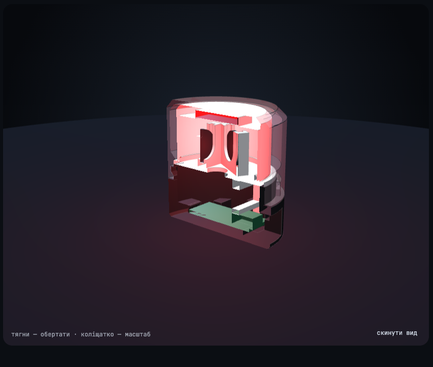

# Корпус

Ø38 × 36,1 мм, п'ять деталей, друк без підтримок і без AMS. Модель параметрична, на Python (manifold3d + trimesh): усі розміри й зазори — у `case/build.py`.

| У зборі | Розріз |
|---|---|
|  |  |

Покрутити, розібрати і приміряти кольори: `case/preview/index.html` (або `python3 web/serve.py` і «Корпус у 3D»).

## Деталі

| Деталь | Файл | Філамент | На столі, мм | Як лежить | Навіщо |
|---|---|---|---|---|---|
| основа | `base.stl` | чорний | 38 × 38 × 18 | дном донизу | тримає плату, тунель під USB-C, шийка з байонетом |
| рамка | `clamp.stl` | білий | 15,3 × 23,4 × 2,5 | плазом | притискає плату за корпус USB-роз'єму |
| диск із кишенями | `carrier.stl` | білий | 33 × 32,8 × 12,9 | диском донизу | три кишені під платки діодів, колодязь для дротів |
| розсіювач | `diffuser.stl` | білий | 30 × 30 × 16,8 | догори дном | розмиває світло і ховає нутрощі; у стелі гніздо під сенсор |
| ковпак | `dome.stl` | прозорий | 38 × 38 × 23,8 | догори дном | зовнішня оболонка, замикається поворотом |

## Файли до друку

Усе лежить у `case/stl/`, деталі вже в положенні для друку.

| Плита | Що в ній | Філамент |
|---|---|---|
| `plate_black.3mf` | основа | чорний |
| `plate_white.3mf` | диск із кишенями, розсіювач, рамка | білий |
| `plate_clear.3mf` | ковпак | прозорий |

Поруч ті самі деталі окремими STL — для іншого розкладу кольорів. Деталі у 3MF лежать від кута координат; якщо слайсер не відцентрує їх сам, натисни «Arrange».

## Налаштування слайсера

- Шар 0,2 мм, сопло 0,4 мм.
- Без підтримок. Єдине нависання — стеля тунелю USB, це міст 14 мм між двома стінками.
- Компенсацію «слонячої ноги» лиши ввімкненою: на неї розраховані посадки рамки й диска.
- Для ковпака й розсіювача шов постав «ззаду» або «вирівняний».
- Крізь прозорий низ ковпака видно шийку основи із зубами. Щоб сховати — заміна філаменту на висоті 15,5 мм дасть непрозорий поясок.

## Як воно тримається

- **Ковпак** надягається на шийку основи: три зуби заходять у вертикальні пази, далі поворот за годинниковою. Полиця паза плавно піднімається і затягує ковпак донизу приблизно на 25° з 35° ходу.
- **Розсіювач** на 0,1 мм вищий за місце під ковпаком, тож закручений ковпак притискає його до диска — він не бовтається.
- **Плата** лежить на ребрі, заднім краєм під гачком; спереду її тримає рамка, якій диск не дає піднятись.
- **Сенсор** сидить у гнізді товстої (3,2 мм) стелі розсіювача. Крізь неї модуль не видно, а до пальця лишається 2,0 мм пластику: 0,8 білого і 1,2 прозорого.

## Зазори

| Де | Зазор, мм |
|---|---|
| шийка основи в спідниці ковпака | 0,20 на радіус |
| зуб у пазу ковпака | 0,30 |
| диск у ковпаку | 0,30 на радіус |
| плата в гнізді | 0,20 з боків, 0,30 по довжині |
| платка діода в кишені | 0,20 на радіус, паз 1,5 мм |
| ніжка рамки в пазу | 0,20 з боку |
| рамка до диска | 0,15 |
| сенсор у гнізді (15,5 × 11,5 × 2,4 мм) | 0,25 з боку |
| розсіювач на бортику диска | 0,10 на радіус |
| розсіювач під ковпаком | −0,10 (натяг) |
| рамка на роз'ємі USB | −0,15 (натяг) |

Найтонші елементи: стінка розсіювача й шар над сенсором 0,8 мм, губи кишень 0,9 мм, стінка ковпака в пазах 1,0 мм.

## Перебудувати і перевірити

```sh
python3 -m venv .venv && .venv/bin/pip install -r case/requirements.txt
.venv/bin/python case/build.py            # STL і 3MF у case/stl/
.venv/bin/python case/verify.py           # перевірка, код виходу 1 при проблемах
.venv/bin/python case/export_preview.py   # оновити моделі на сторінці превью
```

`verify.py` перевіряє: сітки замкнені й кожна деталь — одне тіло; деталі стоять на столі й не мають нависань понад 45° (крім моста над тунелем); у складеному стані нічого не перетинається, крім двох задуманих натягів; кожна деталь доходить до місця без зачіпань; ковпак після повороту не знімається і затягує навіть при відхиленні висоти на ±0,2 мм.

Чого перевірка не бачить: реальну точність принтера і розміри твоїх деталей. Перед друком звір штангенциркулем три розміри, взяті як типові:

| Параметр у `build.py` | Значення | Що це |
|---|---|---|
| `PCB_T` | 1,0 мм | товщина плати ESP |
| `LED_PCB_T` | 1,2 мм | товщина платки діода без самого діода |
| `TOUCH_L`, `TOUCH_W`, `TOUCH_T` | 15 × 11 × 2 мм | модуль TTP223 з деталями |

Якщо замок ковпака вийде тугим або вільним — це `FIT`; якщо розсіювач бовтається або не дає докрутити ковпак — `DIFF_PRELOAD`.

Тексти й таблиці на сторінці превью після зміни моделі треба оновити вручну: `export_preview.py` міняє лише 3D-моделі.
