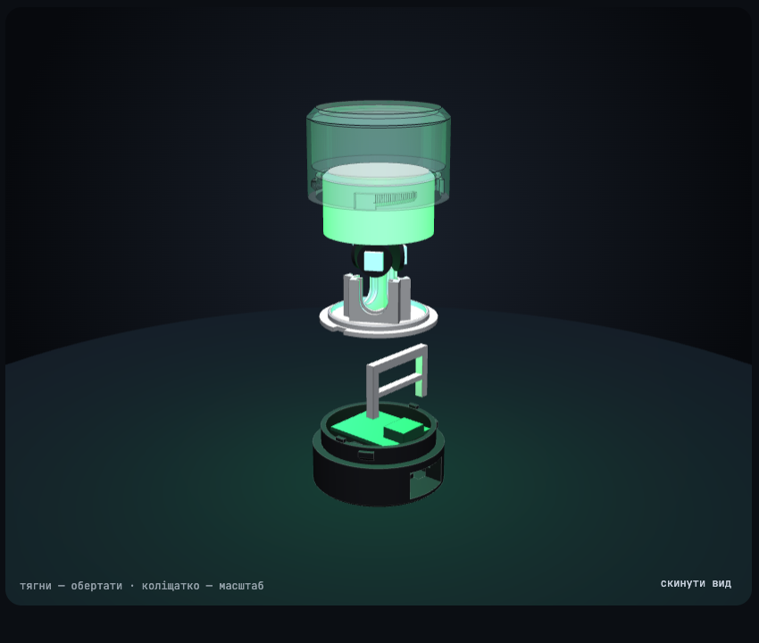

# Підключення і пайка

Векторна версія: [images/wiring.svg](images/wiring.svg). Дуга на схемі означає, що дріт перестрибує інший без з'єднання; з'єднання позначені крапкою.

## Що куди

Лівий ряд плати, якщо дивитись зверху з USB угору: 5V, GND, 3V3, GPIO4, GPIO3, GPIO2, GPIO1, GPIO0.

| Дріт | Звідки → куди | Довжина |
|---|---|---|
| червоний | **5V** плати → 5V платки 1, далі на 5V платок 2 і 3 | ≈ 65 + 2 × 30 мм |
| чорний | **GND** плати → GND платки 1, далі на GND платок 2 і 3 | ≈ 65 + 2 × 30 мм |
| зелений | **GPIO3** → резистор 330 Ом → DIN платки 1 | ≈ 65 мм |
| зелений | DOUT платки 1 → DIN платки 2, DOUT платки 2 → DIN платки 3 | 2 × 30 мм |
| жовтий | **3V3** плати → VCC сенсора | ≈ 80 мм |
| чорний | **GND** → GND сенсора | ≈ 80 мм |
| синій | I/O сенсора → **GPIO1** | ≈ 80 мм |

Довжини прикинуті з моделі, а не з готового виробу — лиши запас 1–2 см.

Зауваги:

- **GND на платі один.** Землю сенсора можна взяти з контакту GND будь-якої платки діода (так на схемі) або впаяти другий дріт у той самий отвір плати.
- **Сенсор живи від 3V3, не від 5V:** тоді його вихід має безпечний для плати рівень.
- **Не чіпай GPIO2, GPIO8, GPIO9** — від них залежить завантаження плати.
- **Дані діодів — GPIO3.** Інший пін задається прапорцем `LED_PIN` у `firmware/platformio.ini`.
- **Стрілка на платці діода** показує напрям від DIN до DOUT.

## Порядок пайки

Кінці дротів до плати ESP паяються останніми: платки діодів і сенсор не пролазять крізь колодязь у диску (Ø6,4 мм), тож дроти треба спершу протягнути.

1. **Наріж дроти** за таблицею.
2. **Спаяй ланцюжок діодів.** До платки 1 — три довгі дроти (5V, GND, DIN), далі перемички до платки 2 і від неї до платки 3.
3. **Припаяй три дроти до сенсора** (VCC, GND, I/O).
4. **Перевір без корпусу.** Залий тестову прошивку (`cd firmware && pio run -e touchtest -t upload`), тимчасово прихопи дроти до плати: діоди мають світитись, поки палець на сенсорі.
5. **Засунь платки в кишені диска** згори, діодами назовні, дроти — в колодязь по центру, вниз. Закріпи краплею клею.
6. **Вклей сенсор у гніздо розсіювача** гладким боком до стелі, пропусти його дроти в той самий колодязь і надягни розсіювач на диск.
7. **Припаяй дроти до плати ESP** згори, з боку USB-роз'єму. Резистор — у розрив дроту GPIO3, у термозбіжку біля плати. Знизу хвостики обріж до 1,5 мм: під платою лише стільки місця.
8. **Залий основну прошивку** і збери корпус.

## Складання корпусу

1. Заведи плату заднім краєм під гачок і поклади в основу, USB — у тунель.
2. Встав рамку ніжками в пази: нижня перекладина ляже на роз'єм.
3. Поклади диск із діодами й розсіювачем на шийку, вирізами на два шипи.
4. Надягни ковпак і поверни за годинниковою стрілкою приблизно на 25°, доки не затягнеться.

Ковпак притискає розсіювач до диска, а диск до шийки; диск не дає піднятись рамці, яка тримає плату за USB-роз'єм. Тому плата сидить щільно лише із закрученим ковпаком.
